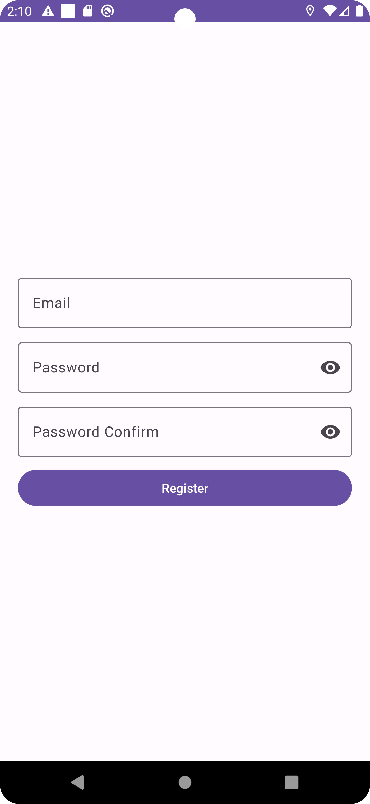
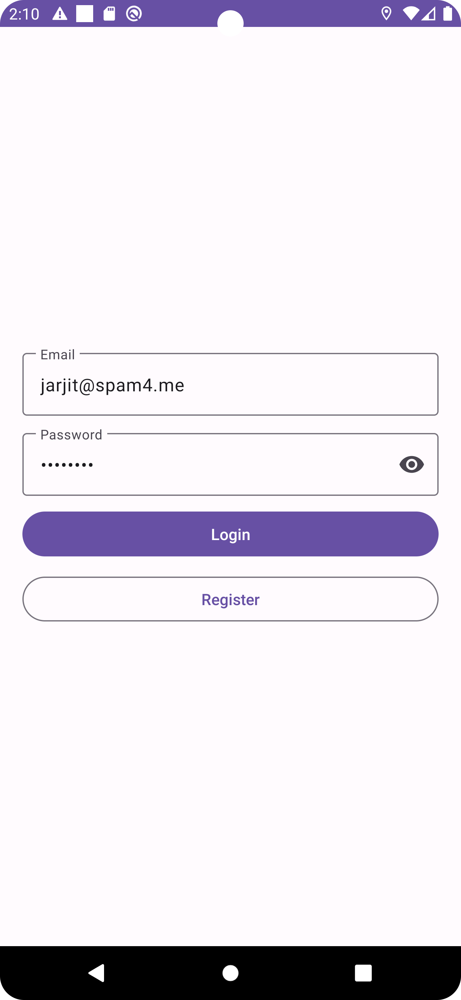
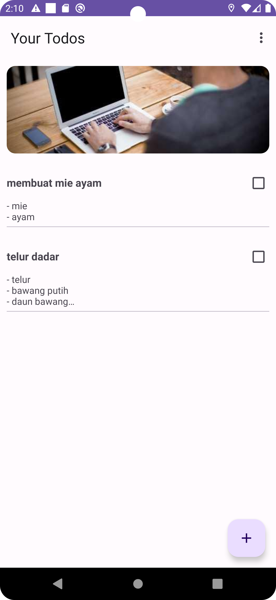
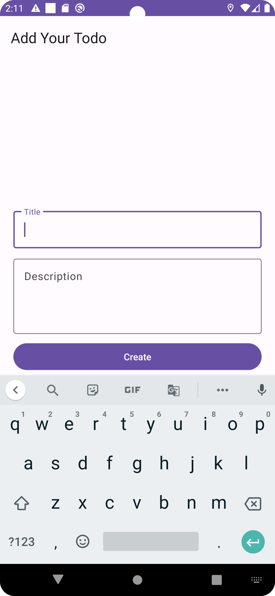
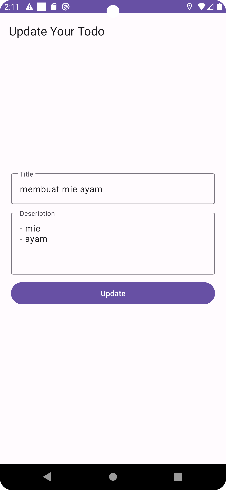
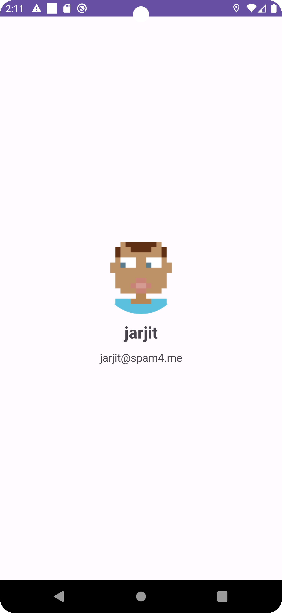

# Todo App
This project will demonstrate How to Build Todo App for Bootcamp TETI UGM 2024.
The implementation breakdown into some branches:
- `inmemory-data`
- `rest-api`
- `firebase-auth`
- `firebase-firestore`

you can check the final implementation inside `main` branch

## Requirements
- Git
- Android Studio Hedgehog | 2023.1.1
- JDK 17

## How to Run (Local)
- Clone this project using git 
- Create firebase project first and add the `google-services.json` into your `:app`, [more details](https://firebase.google.com/docs/android/setup)
- Open this project using Android Studio
- Wait for sync the project
- After sync project finished, just click play button to run to the AVD

# Screenshots
the following are screenshots of the final implementation about this project

| Register | Login | Todo List |
|-|-|-|
||||

| Todo Add | Todo Update | Profile |
|-|-|-|
||||